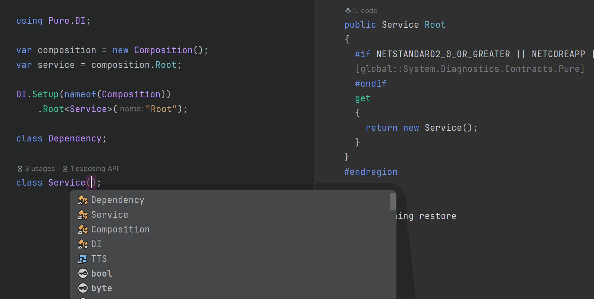

## Schrödinger's cat will demonstrate how it all works [](samples/ShroedingersCat)

### The reality is


### Let's create an abstraction

```c#
interface IBox<out T>
{
    T Content { get; }
}

interface ICat
{
    State State { get; }
}

enum State
{
    Alive,
    Dead
}
```

### Here's our implementation

```c#
class CardboardBox<T>(T content) : IBox<T>
{
    public T Content { get; } = content;

    public override string ToString() => $"[{Content}]";
}

class ShroedingersCat(Lazy<State> superposition) : ICat
{
    // The decoherence of the superposition
    // at the time of observation via an irreversible process
    public State State => superposition.Value;

    public override string ToString() => $"{State} cat";
}

```

It is important to note that our abstraction and implementation knows nothing about the magic of DI or any frameworks.

### Let's glue it all together

Add the _Pure.DI_ package to your project:

[](https://www.nuget.org/packages/Pure.DI)

Let's bind the abstractions to their implementations and set up the creation of the object graph:

```c#
partial class Composition
{
  void Setup() => 
    DI.Setup(nameof(Composition))
        // Models a random subatomic event that may or may not occur
        .Bind().As(Singleton).To<Random>()
        // Represents a quantum superposition of 2 states: Alive or Dead
        .Bind().To(ctx =>
        {
          ctx.Inject<Random>(out var random);
          return (State)random.Next(2);
        })
        .Bind().To<ShroedingersCat>()
        // Represents a cardboard box with any contents
        .Bind().To<CardboardBox<TT>>()
        // Composition Root
        .Root<Program>("Root");
}
```

The above code specifies the generation of a partial class named *__Composition__*, this name is defined in the `DI.Setup(nameof(Composition))` call. This class contains a *__Root__* property that returns a graph of objects with an object of type *__Program__* as the root. The type and name of the property is defined by calling `Root<Program>("Root")`. The code of the generated class looks as follows:

```c#
partial class Composition
{
    private object _lock = new object();
    private Random _random;    
    
    public Program Root
    {
      get
      {
        Func<State> stateFunc = new Func<State>(() =>
        {
          if (_random == null)
          {
            lock (_lock)
            {
              if (_random == null)
              {
                _random = new Random();
              }
            }
          }
          
          return (State)_random.Next(2);      
        });
        
        return new Program(
          new CardboardBox<ICat>(
            new ShroedingersCat(
              new Lazy<Sample.State>(
                stateFunc))));    
      }
    }
    
    public T Resolve<T>() { ... }
    
    public object Resolve(Type type) { ... }    
}
```

The `public Program Root { get; }` property here is a [*__Composition Root__*](https://blog.ploeh.dk/2011/07/28/CompositionRoot/), the only place in the application where the composition of the object graph for the application takes place. Each instance is created by only basic language constructs, which compiles with all optimizations with minimal impact on performance and memory consumption. In general, applications may have multiple composition roots and thus such properties. Each composition root must have its own unique name, which is defined when the `Root<T>(string name)` method is called, as shown in the above code.

### Time to open boxes!

```c#
class Program(IBox<ICat> box)
{
  // Composition Root, a single place in an application
  // where the composition of the object graphs for an application take place
  static void Main() => new Composition().Root.Run();

  private void Run() => Console.WriteLine(box);
}
```

The full analog of this application with top-level statements can be found [here](samples/ShroedingersCatTopLevelStatements).

## To summarize

_Pure.DI_ creates efficient code in a pure DI paradigm, using only basic language constructs as if you were writing code by hand. This allows you to take full advantage of Dependency Injection everywhere and always, without any compromise!

<details>
<summary>Just try!</summary>

Download a sample project

```shell
git clone https://github.com/DevTeam/Pure.DI.Example.git
```

And run it from solution root folder

```shell
cd ./Pure.DI.Example
```

```shell
dotnet run
```

</details>