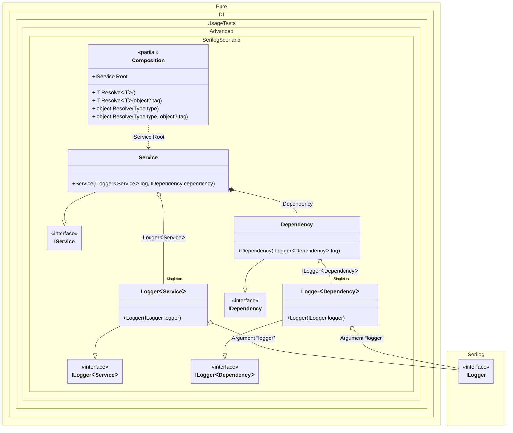

#### Serilog

[](../tests/Pure.DI.UsageTests/Advanced/SerilogScenario.cs)


```c#
interface IDependency;

class Dependency : IDependency
{
    public Dependency(ILogger<Dependency> log)
    {
        log.Information("created");
    }
}

interface IService
{
    IDependency Dependency { get; }
}

class Service : IService
{
    public Service(
        ILogger<Service> log,
        IDependency dependency)
    {
        Dependency = dependency;
        log.Information("created");
    }

    public IDependency Dependency { get; }
}

interface ILogger<T>: ILogger;

class Logger<T>(ILogger logger) : ILogger<T>
{
    private readonly ILogger _logger =
        logger.ForContext(typeof(T));

    public void Write(LogEvent logEvent) =>
        _logger.Write(logEvent);
}

class EventSink(ICollection<LogEvent> events)
    : ILogEventSink
{
    public void Emit(LogEvent logEvent) =>
        events.Add(logEvent);
}

partial class Composition
{
    private void Setup() =>
        DI.Setup(nameof(Composition))
            .Arg<ILogger>("logger")
            .Bind().As(Lifetime.Singleton).To<Logger<TT>>()

            .Bind().To<Dependency>()
            .Bind().To<Service>()
            .Root<IService>(nameof(Root));
}

var events = new List<LogEvent>();
var serilogLogger = new LoggerConfiguration()
    .WriteTo.Sink(new EventSink(events))
    .CreateLogger();

var composition = new Composition(logger: serilogLogger);
var service = composition.Root;
events.Count.ShouldBe(2);
```

The following partial class will be generated:

```c#
partial class Composition
{
  private readonly Composition _root;
  private readonly Lock _lock;

  private Logger<Service>? _singletonLogger47;
  private Logger<Dependency>? _singletonLogger48;

  private readonly Serilog.ILogger _argLogger;

  [OrdinalAttribute(10)]
  public Composition(Serilog.ILogger logger)
  {
    _argLogger = logger ?? throw new ArgumentNullException(nameof(logger));
    _root = this;
    _lock = new Lock();
  }

  internal Composition(Composition parentScope)
  {
    _root = (parentScope ?? throw new ArgumentNullException(nameof(parentScope)))._root;
    _argLogger = _root._argLogger;
    _lock = _root._lock;
  }

  public IService Root
  {
    [MethodImpl(MethodImplOptions.AggressiveInlining)]
    get
    {
      if (_root._singletonLogger48 is null)
      {
        using (_lock.EnterScope())
        {
          if (_root._singletonLogger48 is null)
          {
            _root._singletonLogger48 = new Logger<Dependency>(_argLogger);
          }
        }
      }

      if (_root._singletonLogger47 is null)
      {
        using (_lock.EnterScope())
        {
          if (_root._singletonLogger47 is null)
          {
            _root._singletonLogger47 = new Logger<Service>(_argLogger);
          }
        }
      }

      return new Service(_root._singletonLogger47!, new Dependency(_root._singletonLogger48!));
    }
  }

  [MethodImpl(MethodImplOptions.AggressiveInlining)]
  public T Resolve<T>()
  {
    return Resolver<T>.Value.Resolve(this);
  }

  [MethodImpl(MethodImplOptions.AggressiveInlining)]
  public T Resolve<T>(object? tag)
  {
    return Resolver<T>.Value.ResolveByTag(this, tag);
  }

  [MethodImpl(MethodImplOptions.AggressiveInlining)]
  public object Resolve(Type type)
  {
    var index = (int)(_bucketSize * ((uint)RuntimeHelpers.GetHashCode(type) % 1));
    ref var pair = ref _buckets[index];
    return pair.Key == type ? pair.Value.Resolve(this) : Resolve(type, index);
  }

  [MethodImpl(MethodImplOptions.NoInlining)]
  private object Resolve(Type type, int index)
  {
    var finish = index + _bucketSize;
    while (++index < finish)
    {
      ref var pair = ref _buckets[index];
      if (pair.Key == type)
      {
        return pair.Value.Resolve(this);
      }
    }

    throw new InvalidOperationException($"{CannotResolveMessage} {OfTypeMessage} {type}.");
  }

  [MethodImpl(MethodImplOptions.AggressiveInlining)]
  public object Resolve(Type type, object? tag)
  {
    var index = (int)(_bucketSize * ((uint)RuntimeHelpers.GetHashCode(type) % 1));
    ref var pair = ref _buckets[index];
    return pair.Key == type ? pair.Value.ResolveByTag(this, tag) : Resolve(type, tag, index);
  }

  [MethodImpl(MethodImplOptions.NoInlining)]
  private object Resolve(Type type, object? tag, int index)
  {
    var finish = index + _bucketSize;
    while (++index < finish)
    {
      ref var pair = ref _buckets[index];
      if (pair.Key == type)
      {
        return pair.Value.ResolveByTag(this, tag);
      }
    }

    throw new InvalidOperationException($"{CannotResolveMessage} \"{tag}\" {OfTypeMessage} {type}.");
  }

  private readonly static int _bucketSize;
  private readonly static Pair<Type, IResolver<Composition, object>>[] _buckets;

  static Composition()
  {
    var valResolver_0000 = new Resolver_0000();
    Resolver<IService>.Value = valResolver_0000;
    _buckets = Buckets<Type, IResolver<Composition, object>>.Create(
      1,
      out _bucketSize,
      new Pair<Type, IResolver<Composition, object>>[1]
      {
         new Pair<Type, IResolver<Composition, object>>(typeof(IService), valResolver_0000)
      });
  }

  private const string CannotResolveMessage = "Cannot resolve composition root ";
  private const string OfTypeMessage = "of type ";

  private class Resolver<T>: IResolver<Composition, T>
  {
    public static IResolver<Composition, T> Value = new Resolver<T>();

    public virtual T Resolve(Composition composite)
    {
      throw new InvalidOperationException($"{CannotResolveMessage}{OfTypeMessage}{typeof(T)}.");
    }

    public virtual T ResolveByTag(Composition composite, object tag)
    {
      throw new InvalidOperationException($"{CannotResolveMessage}\"{tag}\" {OfTypeMessage}{typeof(T)}.");
    }
  }

  private sealed class Resolver_0000: Resolver<IService>
  {
    public override IService Resolve(Composition composition)
    {
      return composition.Root;
    }

    public override IService ResolveByTag(Composition composition, object tag)
    {
      switch (tag)
      {
        case null:
          return composition.Root;

        default:
          return base.ResolveByTag(composition, tag);
      }
    }
  }
}
```

Class diagram:



